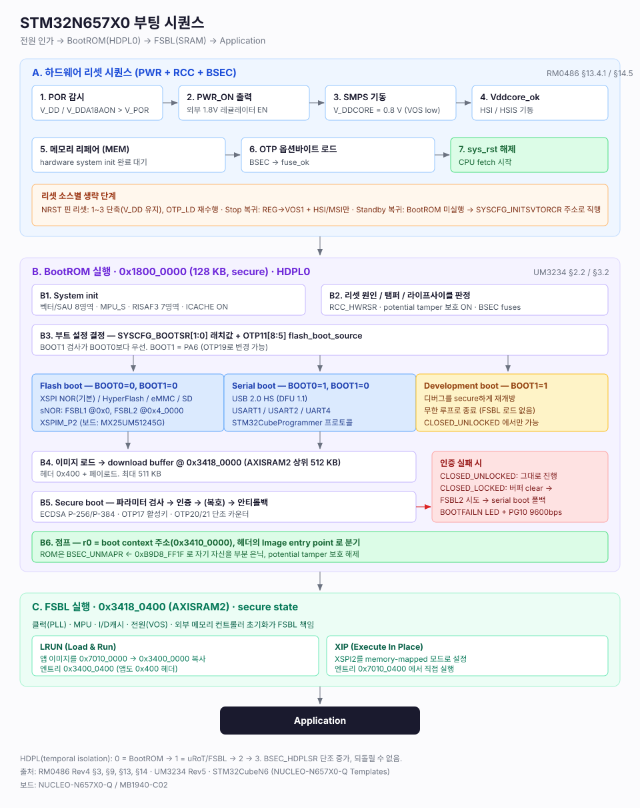
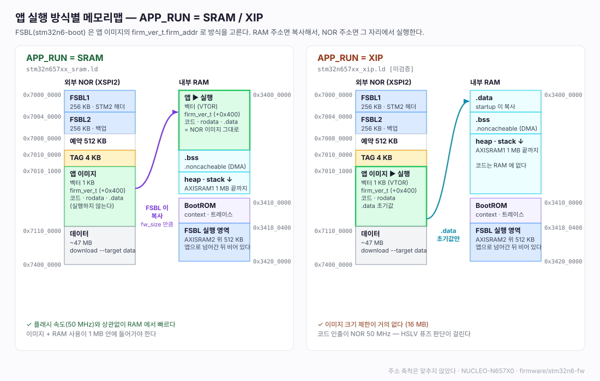

# NUCLEO-N657X0

STM32N657 (Cortex-M55, 800 MHz) 보드 **NUCLEO-N657X0-Q** 에서 FSBL 부트로더와 앱 펌웨어를 처음부터 만든 프로젝트입니다.
STM32CubeIDE 없이 CMake + arm-none-eabi-gcc + VSCode 로 빌드하고, macOS / Windows 에서 같은 방식으로 씁니다.

STM32N6 에는 내부 플래시가 없습니다. 전원이 들어오면 BootROM 이 외부 NOR 에 있는 FSBL 을 내부 SRAM 으로 복사해 실행하고, 앱은 FSBL 이 다시 꺼내 실행합니다.
이 저장소는 그 과정을 직접 구현하면서 알게 된 것(부트 규약, 서명, XIP, 디버거 연결 문제 등)을 기능별 문서로 남깁니다.



## 부트로더 / 펌웨어 구조 레퍼런스

STM32N6 뿐 아니라 **부트로더 + 앱 구조를 직접 설계할 때 참고하기 좋은 예시**가 되도록 만들었습니다. ST 예제 코드를 가져오지 않고 직접 작성했으며 MIT 라이선스라 그대로 가져다 쓸 수 있습니다.

| 주제 | 이 프로젝트에서 볼 수 있는 것 |
|---|---|
| 역할 분리 | 부트로더(FSBL)는 부팅 판정 · 다운로드 · 앱 실행만, 앱은 기능만. HAL / 드라이버 구조는 둘이 같다 |
| 앱 이미지 형식 | 앱 앞의 TAG(크기 · CRC)와 이미지 안의 버전 정보(`firm_ver_t`)로 부트로더가 앱을 검증하고 실행 방식을 고른다 |
| 부트로더 진입 | 앱의 `reset boot` · 다운로드 툴의 명령(RTC 백업 레지스터), 리셋 두 번, 앱이 없거나 깨졌을 때 |
| 앱으로 넘어가기 | DMA · 인터럽트 · 캐시 · 스택 한계(MSPLIM) 정리 후 VTOR / MSP / PC 전환 |
| 안전한 자기 업데이트 | 부트로더를 두 벌(FSBL1 / FSBL2) 두고 매직을 마지막에 써서 쓰다가 전원이 끊겨도 부팅한다 |
| 다운로드 프로토콜 | CLI 와 같은 UART 를 함께 쓰는 패킷 프로토콜, 보율 협상, 호스트 툴(Python) |
| 실행 위치 | 같은 소스를 링커 스크립트만 바꿔 SRAM 실행 / XIP 로 빌드 |
| 개발 도구 | 직접 만든 외부 로더, 서명 · TAG 를 붙이는 쓰기 스크립트, VSCode 태스크 / 디버그 구성 |

## 주요 기능

| 기능 | 내용 | 문서 |
|---|---|---|
| 클럭 | CPU 800 MHz (overdrive, V<sub>DDCORE</sub> 0.89 V) | [22](firmware/docs/22-cpu-800mhz.md) |
| UART / CLI | ST-LINK VCP, DMA 원형 수신, 로그 링 버퍼, CLI | [21](firmware/docs/21-uart-cli.md) |
| BootROM 트레이스 | BootROM 이 SRAM 에 남긴 부팅 기록을 읽어 CLI 로 보여 준다 | [23](firmware/docs/23-bootrom-trace.md) |
| 외부 NOR | XSPI2 OPI DTR (MX25UM51245G 64 MB), 읽기 / 쓰기 / 지우기, XIP 약 100 MB/s | [24](firmware/docs/24-xspi-nor.md) |
| RTC / 리셋 | LSE RTC, 백업 레지스터로 부트 모드 전달, 리셋 원인, 리셋 두 번 눌러 부트로더 진입 | [25](firmware/docs/25-rtc-reset.md) |
| Flash boot | 이미지 서명 → 직접 만든 외부 로더로 NOR 기록 → 보드 단독 부팅 (`flash.py`) | [26](firmware/docs/26-flash-boot.md) |
| SWD attach | 돌고 있는 펌웨어에 디버거를 붙이면 보드가 멈추던 문제의 원인과 해결 | [27](firmware/docs/27-swd-attach.md) |
| UART 다운로드 | CLI 포트 하나로 FSBL / 앱 / 데이터 다운로드, 보율 올리기 (4 Mbps), FSBL1 / FSBL2 로 전원이 끊겨도 안전한 업데이트 | [28](firmware/docs/28-uart-download.md) |
| FSBL / 앱 분리 | FSBL 이 부트로더를 겸하고, 앱을 SRAM 으로 복사해 실행하거나 NOR 에서 바로 실행(XIP) | [29](firmware/docs/29-app-split.md) |

## 구성

| 경로 | 내용 |
|---|---|
| [firmware/stm32n6-boot](firmware/stm32n6-boot) | FSBL. BootROM 이 AXISRAM2 에 올려 실행한다. 부팅 판정, UART 다운로드, 앱 실행 |
| [firmware/stm32n6-fw](firmware/stm32n6-fw) | 앱. 빌드 옵션 `APP_RUN` 으로 SRAM / XIP 중 실행 방식을 고른다 |
| [firmware/stm32n6-ext-loader](firmware/stm32n6-ext-loader) | STM32CubeProgrammer 외부 로더 (`.stldr`). FSBL 의 xspi 드라이버를 그대로 쓴다 |
| [firmware/docs](firmware/docs) | 부팅 레퍼런스와 기능별 구현 기록 |
| [hardware](hardware) | 보드 회로도 (MB1940-C02) |



## 빠르게 시작하기

준비물: CMake, arm-none-eabi-gcc, Python 3, STM32CubeCLT (Programmer / ST-LINK gdbserver). 자세한 설정은 [10-dev-environment.md](firmware/docs/10-dev-environment.md) 에 있습니다.

```bash
# FSBL 빌드 → ST-LINK 로 NOR 에 기록 (외부 로더 사용)
cd firmware/stm32n6-boot
cmake -S . -B build && cmake --build build -j20
python3 tools/flash.py

# 앱 빌드 (기본 SRAM, XIP 는 -DAPP_RUN=XIP) → UART 로 다운로드 후 실행
cd ../stm32n6-fw
cmake -S . -B build && cmake --build build -j20
python3 ../stm32n6-boot/tools/download.py --target fw build/stm32n6-fw.bin
```

- 보드 단독 부팅은 Flash boot 점퍼(JP1 = 0, JP2 = 0), 개발 중 SRAM 적재는 Development boot(JP2 = 1) 입니다 ([03](firmware/docs/03-board-boot-mapping.md))
- VSCode 에는 빌드 / ST-LINK 쓰기 / UART 다운로드 태스크와 디버그 구성(Flash + Attach)이 들어 있습니다
- 시리얼 터미널은 ST-LINK VCP 115200 bps 입니다. 부팅 로그 뒤 `cli#` 에서 `help` 로 명령을 볼 수 있습니다

## 문서

[firmware/docs/README.md](firmware/docs/README.md) 에 전체 목차, 현재 상태, 다음 작업, 참고 자료가 있습니다.

## 라이선스

[MIT](LICENSE). ST HAL / CMSIS 는 각 파일에 적힌 라이선스를 따릅니다.
