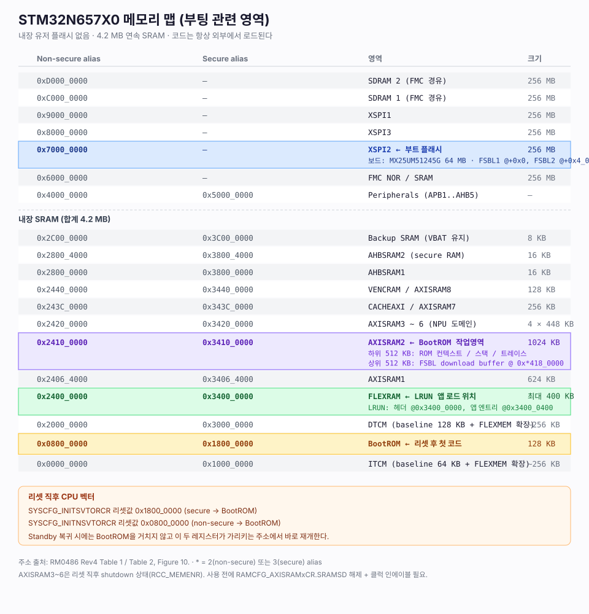

# 01. STM32N657X0 부팅 프로세스

> 대상: STM32N657X0H3Q / NUCLEO-N657X0-Q (MB1940-C02)
> 출처: RM0486 Rev4, DS14791 Rev10, UM3234 Rev5, MB1940-C02 회로도


---

## 0. 전제 — 내장 유저 플래시가 없다

STM32N657X0는 **4.2 MB 연속 SRAM + 8 KB 백업 SRAM**만 갖고 있고 내장 NOR 플래시가 없다 (DS14791 §1).
따라서 부팅은 항상 다음 구조다.

```
BootROM(온칩 ROM) → 외부 플래시 또는 시리얼에서 이미지를 SRAM으로 복사 → 실행
```

STM32F/H 처럼 `0x0800_0000`에서 유저 코드를 바로 fetch 하는 모델이 **아니다**.

| 항목 | 주소 | 크기 |
|---|---|---|
| BootROM (secure alias) | `0x1800_0000` | 128 KB |
| BootROM (non-secure alias) | `0x0800_0000` | 128 KB |
| `SYSCFG_INITSVTORCR` 리셋값 | `0x1800_0000` | — |
| `SYSCFG_INITNSVTORCR` 리셋값 | `0x0800_0000` | — |

BootROM 내부는 secure 81 KB / non-secure 47 KB 로 나뉘고, 각각 always-mapped(AM) 와
unmappable(UM) 영역이 있다. ROM은 실행이 끝날 때 UM 영역을 스스로 숨긴다 (UM3234 §3.1).

---

## 1. 전원 인가 → BootROM 진입 (하드웨어 시퀀스)

RM0486 §13.4.1 (Figure 18) + §14.5.12 (Figure 37).

| # | 단계 | 조건 / 신호 |
|---|---|---|
| 1 | POR가 V<sub>DD</sub>, V<sub>DDA18AON</sub> 감시 | `> V_POR` |
| 2 | **`PWR_ON` 핀 assert** → 외부 레귤레이터(V<sub>DDA18PMU</sub>, V<sub>DDSMPS</sub>) 인에이블 | 출력 핀 |
| 3 | SMPS step-down 리셋 해제, V<sub>DDCORE</sub> = **0.8 V (VOS low)** | `Vdda18pmu_ok` |
| 4 | 시스템 리셋 해제 준비, **HSI / HSIS 기동** | `Vddcore_ok` |
| 5 | **메모리 리페어** 완료 대기 | hardware system init |
| 6 | **BSEC가 OTP 옵션바이트 로드** | `fuse_ok` |
| 7 | **`sys_rst` 해제 → CPU fetch** | — |

`sys_rst`는 *옵션바이트 로딩 완료* + *HSIS 동작* + *메모리 리페어 완료* 세 조건이 모두 맞아야 풀린다
(RM0486 §14.5.7).

### 리셋 소스별 단축

| 리셋 | 생략되는 단계 |
|---|---|
| **NRST 핀 리셋** | V<sub>DD</sub> 유지 → 레귤레이터 정정 짧음, HSI가 켜져 있었으면 재기동 지연 생략. **OTP_LD는 재수행** |
| **Stop 복귀** | REG→VOS1 + HSI/MSI 재기동만. `HSISTOPEN=MSISTOPEN=1` 이면 그것도 생략 |
| **Standby 복귀** | V<sub>DDCORE</sub>가 꺼졌으므로 HSI/HSIS 재기동 필수. **BootROM은 실행되지 않는다** |

### 리셋 소스 판별

`RCC_RSR` / `PWR_CSR3.SBF` (RM0486 Table 67). BootROM 자신은 `RCC_HWRSR`를 읽고 바로 클리어한다
(UM3234 §3.2.3) — **애플리케이션이 리셋 원인을 보려면 `RCC_RSR`을 봐야 한다.**

| 상황 | 세워지는 플래그 |
|---|---|
| Power-on reset | `PORRSTF` + `PINRSTF` + `BORRSTF` |
| Pin reset (NRST) | `PINRSTF` |
| Brownout | `BORRSTF` + `PINRSTF` |
| SW reset (SYSRESETREQ) | `SFTRSTF` + `PINRSTF` |
| Lockup | `LCKRSTF` + `PINRSTF` |
| WWDG / IWDG | `WWDGRST` / `IWDGRSTF` + `PINRSTF` |
| Stop/Standby 오진입 | `LPWRRSTF` + `PINRSTF` |
| Standby 정상 탈출 | `SBF` (PWR_CSR3) + `PINRSTF` |

---

## 2. 메모리 맵



주의할 두 가지:

- **AXISRAM3 ~ AXISRAM6 은 리셋 직후 shutdown 상태**다 (RM0486 §10.4). 쓰기는 무시되고 읽으면 0이 나온다.
  사용하려면 `RAMCFG_AXISRAMxCR.SRAMSD` 를 0으로 쓰고 → 40 ns 대기 → `RCC_MEMENR` 로 클럭 인에이블.
- **FLEXMEM 구성**(`SYSCFG_CM55TCMCR.CFGITCMSZ/CFGDTCMSZ`)은 **write-once, 런타임 변경 불가**.
  두 필드를 반드시 **같은 접근에서 한 번에** 써야 한다. 하나만 쓰면 다른 하나는 다음 POR까지 잠긴다.

---

## 3. 부트 모드 결정

BootROM은 `SYSCFG_BOOTSR[1:0]` (리셋 해제 시 래치된 핀 값)을 읽는다.

| BOOT0 | BOOT1 | 모드 |
|---|---|---|
| 무관 | **1** | Development boot |
| 0 | 0 | Flash boot |
| 1 | 0 | Serial boot |

- **BOOT1 검사가 BOOT0보다 우선**한다. BOOT1이 0이면 BOOT0을 본다.
  BOOT1이 1이어도 현재 라이프사이클에서 허용되지 않으면 BOOT0을 본다 (UM3234 §3.2.7).
- **BOOT0** = 전용 핀 (볼 G4). **BOOT1** = PA6 (볼 P8), `OTP19[24:21] dev_boot_port` +
  `OTP19[28:25] dev_boot_pin` 으로 다른 핀으로 변경 가능.
- 두 핀 모두 기본적으로 내부 풀다운이 켜져 있어 (`SYSCFG_BOOTCR.BOOTn_PD = 0`) **open이면 0**이다.
- 래치된 값은 `SYSCFG_BOOTSR` 로 소프트웨어에서 읽을 수 있다.

### Flash boot 소스 — `OTP11[8:5] flash_boot_source`

| 값 | 소스 | UM3234 Boot config |
|---|---|---|
| 0 | **XSPI NOR (기본값)** | 6 |
| 1 | SD-Card / SDMMC1 | 2 |
| 2 | e.MMC / SDMMC1 | 4 |
| 3 | XSPI NOR | 6 |
| 4 | XSPI NAND | — |
| 5 | XSPI HyperFlash | 7 |
| 6 | FMC pNAND | — |
| 7 | SD-Card / SDMMC2 | 3 |
| 8 | e.MMC / SDMMC2 | 5 |

**OTP가 비어 있으면(0) 기본은 XSPI NOR**이고, ROM은 이때 **XSPIM_P2** 를 쓴다.
데이터시트 핀 표에서 `XSPIM_P2_*` 신호에만 `(boot)` 표기가 붙어 있는 이유다.
XSPIM은 `MUXEN=0, MODE=1` (swapped) 로 설정되어 XSPI1 컨트롤러가 XSPIM_P2 포트에 연결된다.

### Serial boot

- **USB 2.0 OTG HS** — DFU 1.1, `USB1_OTG_HS`, embedded PHY, 8 EP, VBUS sensing off
- **USART1 / USART2 / UART4** — 9비트 / even parity / 1 stop / 오버샘플 16, 보레이트는 호스트가 결정
  (CubeProgrammer 사용 시 115200)
- **USB가 연결되어 있으면 USART는 이 부팅에서 사용 불가**. USART로 붙으려면 USB를 뽑고 리셋해야 한다.
- 비활성화: `OTP11[16:9] boot_source_disable` (USB/UART), `OTP11[22:20]` (USART 인스턴스별).
  전부 끄면 강제로 다시 켜진다.

### Development boot

- 디버그를 secure 한 방식으로 재개방한 뒤 **무한 루프로 끝난다.** FSBL을 로드하지 않는다.
- `CLOSED_UNLOCKED` 라이프사이클에서만 가능.
- 개발 중 디버거로 SRAM에 코드를 직접 올려 돌리는 통상적인 워크플로가 이 모드다.

---

## 4. 라이프사이클과 보안 부트

리셋마다 하드웨어가 라이프사이클 퓨즈를 읽어 **BSEC-open / BSEC-closed** 를 판정한다.
고객 출하 상태는 **BSEC-closed**이므로 ROM 실행이 강제된다.

| 라이프사이클 | 퓨즈 조건 | ST-FSBL | OEM-FSBL | Dev boot |
|---|---|---|---|---|
| `CLOSED_UNLOCKED` | `secure_boot = 0` | 가능 | 가능(인증 선택) | 가능 |
| `CLOSED_LOCKED_UNPROVD` | + `OTP124.20 = 1` + `OTP18 = 0xF` | 인증 필수 | 불가 | 가능 |
| `CLOSED_LOCKED_PROVD` | + `OTP124.20 = 1` + `OTP18 = 0x1EF` | 가능 | **인증 필수** | 가능 |

### 관련 OTP

| OTP | 필드 | 의미 |
|---|---|---|
| `OTP11[0]` | `no_data_cache` | ROM이 DCACHE 사용 여부 |
| `OTP11[1]` | `no_cpu_pll` | cold boot에서 CPU/AXI PLL 활성 여부 |
| `OTP11[29]` | `tamp_boot_cfg_glob_enable` | 부트 전 탬퍼 설정 활성 |
| `OTP11[30]` | `xspi_3v3` | XSPI가 3.3 V 디바이스인지 (**보드는 1.8 V → 0**) |
| `OTP16[0]` | — | ROM 트레이스 비활성화 |
| `OTP16[1]` | `disable_hse_freq_detect` | HSE 주파수 자동검출 비활성 |
| `OTP16[13:11]` | `HSE_value` | HSE 주파수 고정 (**보드는 48 MHz → 0b110**) |
| `OTP17[7:0]` | `oem_active_signing_key` | 활성 OEM 서명키 인덱스 (단조) |
| `OTP18[3:0]` | `secure_boot` | 0 = CLOSED_UNLOCKED, 1 = CLOSED_LOCKED |
| `OTP18[4]` | `fsbl_decrypt_prio` | 0 = CRYP, 1 = SAES 로 FSBL 복호 |
| `OTP18[8:5]` | `prov_done` | 프로비저닝 완료 여부 |
| `OTP19[28:21]` | `dev_boot_port/pin` | BOOT1 핀 재정의 |
| `OTP20/21` | `oem_fsbl_monotonic_counter` | 안티롤백 카운터 (최대 64) |
| `OTP56/57/58` | `TAMP_*` | 부트 탬퍼 설정 |
| `OTP124[0]` | — | 리셋 시 IWDG 자동 시작 |

> **주의** — `secure_boot` 퓨즈를 태우면 되돌릴 수 없다. 서명 없는(`-nk -of 0x80000000`) 이미지는
> 더 이상 부팅되지 않는다. 개발 중에는 절대 태우지 말 것.

### HDPL (temporal isolation)

| HDPL | `BSEC_HDPLSR` 코딩 | 단계 |
|---|---|---|
| 0 | `0xB4` | BootROM |
| 1 | `0x51` | uRoT / secure boot 1단계 (ST 서명 코드 또는 ROMed 코드) |
| 2 | — | SRAM의 OEM 서명 코드 (2단계) |
| 3 | — | 애플리케이션 런타임 |

- 2비트 단조 증가 카운터. 되돌아가지 않는다. secure privileged 코드만 증가시킬 수 있다.
- SAES가 HUK를 HDPL로 유도해 DHUK를 만들기 때문에, 상위 단계는 하위 단계의 시크릿에 도달할 수 없다.
- BSEC closed 상태에서 ROM은 레벨 0/1 종료 시 `BSEC_UNMAPR ← 0xB9D8_FF1F` 를 써서 자신을 부분 은닉한다.

> RM0486 §3.4 는 HDPL을 `0=ROM / 1=uRoT / 2 / 3` 으로, §4.3.10 은
> `1=ST 서명 코드 / 2=SRAM의 OEM 서명 코드` 로 조금 다르게 서술한다. 두 서술이 정확히
> 어떻게 맞물리는지는 문서상 모호하다.

### 탬퍼와 부팅

- ROM은 실행 시작 시 **항상 `SYSCFG_POTTAMPRSTCR` 를 세팅**해서 potential tamper의 효과
  (크립토 블록 리셋)를 무력화한다. 덕분에 **potential tamper가 걸려 있어도 FSBL은 로드된다.**
- FSBL로 점프하기 직전 이 보호를 해제한다. 이후 판단은 애플리케이션 몫이다
  (`TAMP_CR2.BKERASE` 로 시크릿 소거, 또는 플래그만 클리어).
- **confirmed tamper** 면 ROM은 무한 루프로 끝난다.

---

## 5. 저전력 모드에서의 부팅

**Standby(SRAM retention)에서 깨어날 때 BootROM은 실행되지 않는다** (RM0486 §9.2).
CPU는 `SYSCFG_INITSVTORCR` / `SYSCFG_INITNSVTORCR` 에 설정된 주소에서 바로 시작한다.
이 두 레지스터는 system reset으로 리셋되므로 **Standby 진입 전에 세팅**해야 한다.

Retention 가능 용량 (RM0486 §10.3.2):

| 영역 | 크기 |
|---|---|
| I-TCM baseline | 64 KB (+16 KB ECC) |
| I-TCM extended (FLEXMEM 첫 64 KB) | 64 KB (+16 KB ECC) |
| D-TCM baseline | 4 × 32 KB (+4 × 8 KB ECC) |
| **합계** | **320 KB** |
| 또는 I-TCM baseline만 쓸 때 AXI RAM | 80 KB |
| BKPSRAM | 8 KB (V<sub>BAT</sub>에서도 유지) |

---

## 6. 다음 단계

FSBL이 실제로 어떻게 로드·인증·실행되는지는 [02-fsbl-loading.md](02-fsbl-loading.md) 참고.
이 보드의 실제 결선은 [03-board-boot-mapping.md](03-board-boot-mapping.md) 참고.
