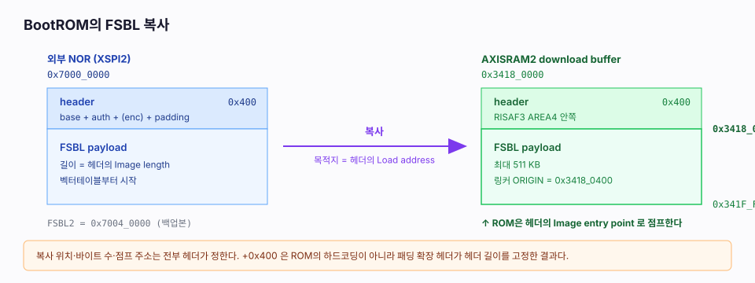
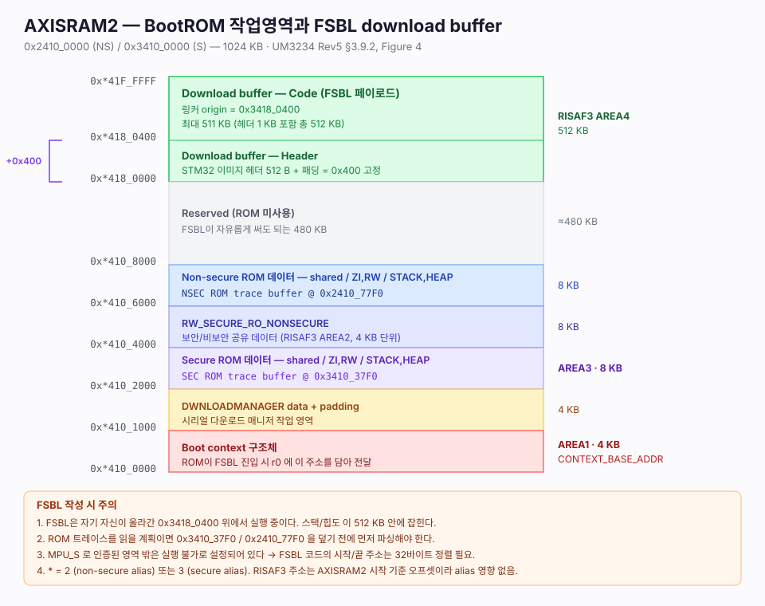
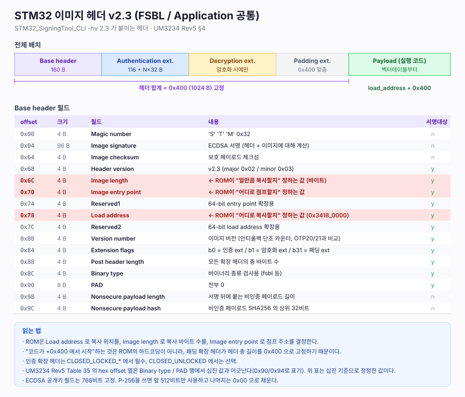
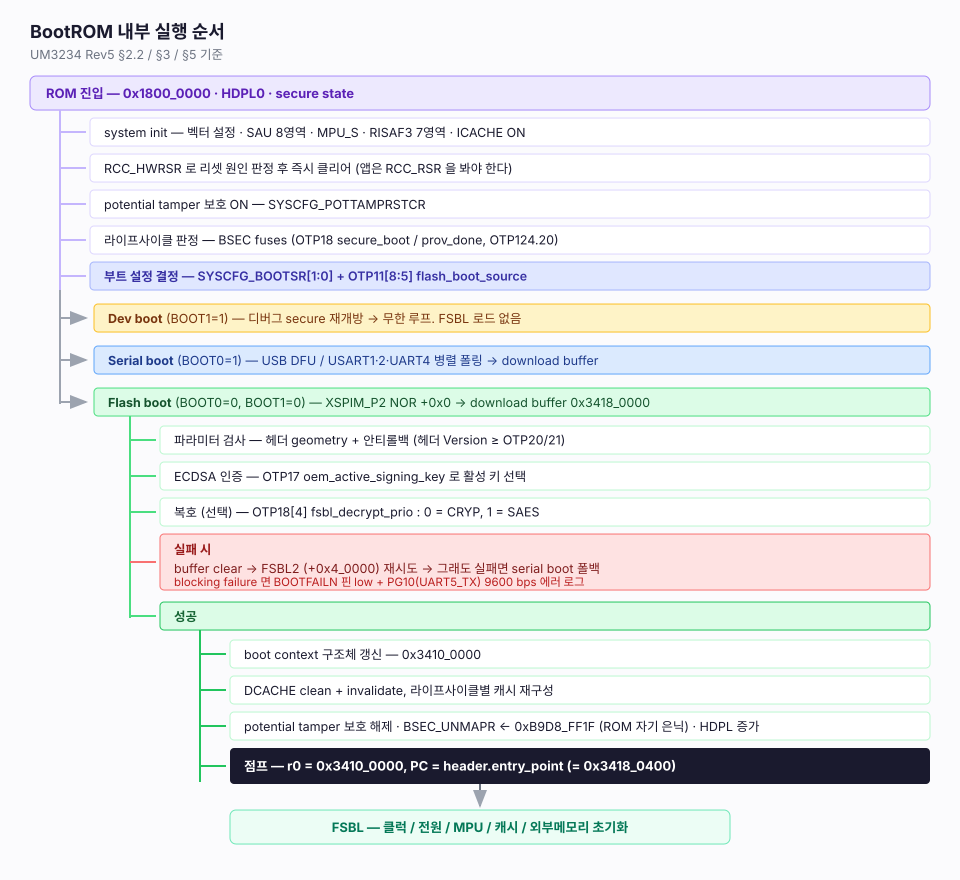

# 02. BootROM의 FSBL 로딩과 실행

> 출처: UM3234 Rev5 §3.9 / §4 / §5, RM0486 Rev4 §3~§5,
> STM32CubeN6 `Projects/NUCLEO-N657X0-Q/Templates/Template_FSBL_*`

---

## 1. 한 눈에

| 항목 | 값 | 근거 |
|---|---|---|
| 외부 플래시 내 FSBL1 위치 | `0x7000_0000` (+0x0) | UM3234 §3.5.3 |
| 외부 플래시 내 FSBL2 위치 | `0x7004_0000` (+0x4_0000) | UM3234 §3.5.3 |
| **복사 목적지 (download buffer)** | **`0x3418_0000`** | 서명툴 `-la 0x34180000`, UM3234 Fig.4/8 |
| **헤더 크기** | **`0x400` (1024 B) 고정** | 패딩 확장 헤더 |
| **엔트리 포인트** | **`0x3418_0400`** | CubeN6 링커 스크립트 전부 |
| **복사 바이트 수** | 헤더의 `Image length` 필드 | UM3234 Table 35 |
| **최대 페이로드** | **511 KB** (헤더 포함 512 KB) | 링커 `LENGTH = 511K` |
| 인계 시 레지스터 | `r0` = boot context 주소 (`0x3410_0000`) | UM3234 §5.1 |



---

## 2. 메모리 배치



AXISRAM2 (1 MB) 는 반으로 나뉜다.

- **하위 512 KB (`0x*410_0000` ~ `0x*417_FFFF`)** — BootROM 전용 작업영역
- **상위 512 KB (`0x*418_0000` ~ `0x*41F_FFFF`)** — FSBL download buffer (RISAF3 AREA4)

`*` = `2`(non-secure alias) 또는 `3`(secure alias).

### UM3234이 정의한 절대 주소 (Table 19)

| 심볼 | 주소 | 용도 |
|---|---|---|
| `CONTEXT_BASE_ADDR` | `0x*410_0000` | boot context 구조체. ROM이 `r0`로 전달 |
| `TRACE_BUFFER_SEC_BASE_ADDR` | `0x3410_37F0` | secure ROM 트레이스 |
| `TRACE_BUFFER_NSEC_BASE_ADDR` | `0x2410_77F0` | non-secure ROM 트레이스 |
| `BOOTROMCODE_VERS_ADDR` | `0x1800_1000` | ROM 코드 버전 구조체 |
| `E1CPVK_COPY_BASE_ADDR` | `0x3800_4000` | E1CPvK 사본 (`CLOSED_LOCKED_UNPROVD` 전용) |
| `DOWNLOAD_BUFFER_BASE_ADDR` | `0x*418_0000` | FSBL download buffer |

> ⚠️ **문서 오류 주의** — UM3234 Rev5 Table 19 는 `DOWNLOAD_BUFFER_BASE_ADDR` 를
> `0xX4108000` 으로 적고 있는데, 같은 문서의 Figure 4 / Figure 8, 서명툴의 `-la 0x34180000`,
> 그리고 CubeN6의 모든 링커 스크립트(`ORIGIN = 0x34180400`)는 **`0x*418_0000`** 을 가리킨다.
> `0x*4108000` 은 오타로 보는 것이 맞다.

### 실측 확인

ST가 배포하는 서명 전 FSBL 바이너리(`OpenBootloader_STM32N6570-DK.bin`)의 벡터테이블 앞 8바이트:

```
00000000: dc6f 1934  b9c4 1834
          └ MSP = 0x34196FDC   └ Reset_Handler = 0x3418C4B9
```

둘 다 `0x3418_0400` 베이스로 링크된 이미지와 정확히 일치한다.

---

## 3. 로딩 절차 (Flash boot / serial NOR 기준)

UM3234 §3.5.3 + §5.

1. XSPI / XSPIM 하드웨어 설정 (`MUXEN=0`, `MODE=1` swapped → XSPI1 ↔ XSPIM_P2), I/O·전원·클럭 설정
2. 오프셋 `0x0` 에서 **FSBL1** 탐색 → download buffer(`0x3418_0000`)로 복사
3. **secure boot 처리** 수행 (아래 §5)
4. 성공 → context 구조체 갱신 후 헤더의 엔트리 포인트로 점프
5. 실패 → download buffer 클리어 → 오프셋 `0x4_0000` 의 **FSBL2** 로 재시도
6. FSBL2도 실패 → buffer 클리어 → **serial boot** 로 폴백

SD / eMMC 는 조금 다르다.

| 디바이스 | 이미지 탐색 방식 |
|---|---|
| SD Card | GPT 헤더(LBA1)에서 FSBL 오프셋 조회. GPT 없으면 기본 **LBA 128 / LBA 640** |
| eMMC | boot partition 에서 읽음 (JEDEC boot operation, 128 KB 배수) |
| serial NOR / HyperFlash | 오프셋 `0x0` / `0x4_0000` 고정 |

전송은 SDMMC 내부 DMA 또는 XSPI를 사용하고, **이미지 전체가 download buffer에 올라온 뒤에**
분석·검증이 시작된다.

---

## 4. 이미지 헤더 v2.3



헤더는 **base header(160 B) + 확장 헤더들 + 패딩 확장 헤더** 로 구성되고,
패딩 확장 헤더가 **총 길이를 `0x400` 으로 고정**한다.

### "얼만큼 / 어디로 / 어디서부터"를 정하는 세 필드

| 오프셋 | 필드 | 역할 |
|---|---|---|
| `0x6C` | `Image length` | **복사할 바이트 수** |
| `0x70` | `Image entry point` | **점프할 주소** |
| `0x78` | `Load address` | **복사할 목적지** |

즉 **`0x400` 오프셋은 ROM에 하드코딩된 값이 아니다.** ROM은 헤더가 시키는 대로 움직인다.
서명 도구가 패딩 확장 헤더로 헤더 총 길이를 `0x400` 으로 맞추고, 엔트리 포인트를
`load_address + 0x400` 으로 계산해 넣기 때문에 결과적으로 항상 `0x3418_0400` 이 되는 것이다.
이렇게 하는 이유는 **인터럽트 벡터 테이블의 정렬을 맞추기 위해서**다.

### 확장 헤더

| 확장 | 타입 시그니처 | 활성 조건 | 내용 |
|---|---|---|---|
| Authentication | `'S' 'T' 0x00 0x02` | `Extension flags` b0 | 공개키 인덱스, 키 개수 N, ECDSA 알고리즘, 공개키(768 b), 키 해시 N개 |
| Decryption | `'S' 'T' 0x00 0x01` | `Extension flags` b1 | 키 크기(128/256), derivation constant, plain hash 128 b |
| Padding | `'S' 'T' 0xFF 0xFF` | `Extension flags` b31 | 패딩 바이트 |

ECDSA 알고리즘 코드: `1` = P-256 NIST, `2` = brainpool 256, `3` = P-384 NIST, `4` = brainpool 384.
공개키 필드는 768비트 고정이라 P-256 이면 앞 512비트만 쓰고 나머지는 `0x00` 으로 채운다.

---

## 5. Secure boot 처리

UM3234 §5. 순서는 다음과 같다.

```
Image loading → Parameter check → Image authentication → Image decryption(선택) → Anti-rollback → Jump
```

### 5.1 파라미터 검사

- 확장 헤더 플래그 존재 확인 (`CLOSED_LOCKED_*` 에서는 인증 확장 헤더가 **필수**)
- 헤더 파라미터와 geometry 검증
- **안티롤백**: 헤더의 `Version number` ≥ `OTP20/21` 단조 카운터

### 5.2 인증

ECDSA 서명이 **헤더 + 이미지 전체**에 대해 계산되어 있다. `OTP17 oem_active_signing_key` 로
현재 유효한 키 인덱스를 관리하고, 키 취소는 최대 8회 가능하다.

### 5.3 복호

`OTP18[4] fsbl_decrypt_prio` 가 CRYP(0) / SAES(1) 중 어느 엔진을 쓸지 결정한다.
키는 OTP의 OEM secret 에서 derivation constant 로 유도된다.

### 5.4 실패했을 때

| 라이프사이클 | 동작 |
|---|---|
| `CLOSED_UNLOCKED` | 그대로 진행 (인증은 강제되지 않음) |
| `CLOSED_LOCKED_*` | 인증 중단 → download buffer 클리어 → FSBL2 → serial boot 폴백 |

---

## 6. ROM → FSBL 인계 시점의 상태

### 6.1 전달값

- **`r0` = boot context 구조체 주소** (`0x3410_0000`)
- PC = 헤더의 `Image entry point`. MSP는 페이로드 벡터테이블 index 0 에서 로드된다
  (Cortex-M 표준 리셋 동작).

boot context 구조체에는 `bootPartitionUsedToBoot` (0 = 없음, 1 = FSBL1, 2 = FSBL2),
`bootInterfaceInstance`, `bootInterfaceSelected`, 그리고 SD 관련 에러 카운터들이 들어 있다
(UM3234 Table 22).

### 6.2 보안/캐시/MPU 상태

UM3234 Table 4.

| 라이프사이클 | 시나리오 | SAU / MPU | RISAF | Cache |
|---|---|---|---|---|
| `CLOSED_UNLOCKED` | Dev boot | SAU 비활성 + MPU 리셋 | RISAF3 클리어 | 캐시 비활성 |
| `CLOSED_UNLOCKED` | OEM FSBL | SAU 비활성 + MPU 리셋 | RISAF3 클리어 | **ICACHE 유지** |
| `CLOSED_LOCKED_PROVD` | OEM FSBL | SAU/MPU 업데이트 비활성 | RISAF3 클리어 | **ICACHE 유지** |
| 전체 | Blocking failure | SAU/MPU 설정 유지 | RISAF3 SEC only | ICACHE off, secure boot면 DCACHE도 off |

- ROM은 부트 초반에 secure 상태에서 **ICACHE를 켠다.** 인증/복호 가속을 위해 DCACHE도 켰다가,
  secure boot 종료 시 clean + invalidate 한다.
- ROM은 `MPU_S` 로 **인증된 바이너리 영역만 실행 가능**하게 만든다 (비인증 페이로드 제외).
  → **FSBL 코드의 시작/끝 주소는 32바이트 정렬이어야 한다.**
- SAU 8개 영역이 설정되어 있다 (UM3234 Table 5). 예: region 5 는 `0x3410_6000`~`0x3FFF_FFFF`
  를 secure + NSC 로 잡는다 — download buffer가 여기 포함된다.

### 6.3 FSBL이 해야 할 일

CubeN6 템플릿 README:
> *"the FSBL project executes in internal RAM, ensures proper MPU, caches and clock setting"*

즉 **클럭(PLL), 전원(VOS), MPU, 캐시, 외부 메모리 컨트롤러 초기화는 전부 FSBL 책임**이다.
`OTP11[1] no_cpu_pll` 이 0이면 ROM이 cold boot에서 CPU/AXI PLL을 켜 주긴 하지만,
최종 구성은 FSBL이 잡아야 한다.

---

## 7. FSBL 이후 — LRUN / XIP

두 모델 모두 **FSBL 자체는 ROM이 SRAM에 복사해서 실행**한다. 차이는 애플리케이션 실행 방식뿐이다.

### LRUN (Load & Run)

```
ROM → FSBL @0x3418_0400 → 앱 이미지를 0x7010_0000 에서 0x3400_0000 으로 복사 → 0x3400_0400 실행
```

| | 값 |
|---|---|
| FSBL 링커 | `ORIGIN = 0x34180400, LENGTH = 511K` |
| 앱 링커 | `RAM : ORIGIN = 0x34000400, LENGTH = 2047K` |

### XIP (Execute In Place)

```
ROM → FSBL @0x3418_0400 → XSPI2 를 memory-mapped 모드로 설정 → 0x7010_0400 에서 직접 실행
```

| | 값 |
|---|---|
| FSBL 링커 | `ORIGIN = 0x34180400, LENGTH = 511K` |
| 앱 링커 | `ROM : ORIGIN = 0x70100400, LENGTH = 511K` / `RAM : ORIGIN = 0x34000000, LENGTH = 2048K` |

**앱 이미지에도 동일하게 `0x400` 헤더가 붙는다.** (`0x7010_0000` 이 헤더, `0x7010_0400` 이 코드)

> CubeN6 의 `Examples_LL/*` 는 FSBL 영역을 255 KB (`LENGTH = 255K`, MDK는 `0x0003FC00`)로
> 보수적으로 잡는다. 하드웨어 한계는 511 KB 이므로 필요하면 늘려도 된다.

---

## 8. 서명

STM32CubeProgrammer 의 `STM32_SigningTool_CLI` 를 쓴다.

### 개발용 (서명 없음, `CLOSED_UNLOCKED` 전용)

```bash
STM32_SigningTool_CLI \
  -bin  Project.bin \
  -nk \
  -of   0x80000000 \
  -t    fsbl \
  -o    Project-trusted.bin \
  -hv   2.3 \
  -dump Project-trusted.bin
```

- `-nk` = no key (서명 생략)
- `-of 0x80000000` = 인증 우회 플래그
- CubeProgrammer **v2.21 이상은 `-align` 옵션을 추가**해야 한다

### 실제 서명 (secure boot)

```bash
STM32_SigningTool_CLI \
  -bin  FSBL.bin \
  -pubk publicKey00.pem publicKey01.pem ... publicKey07.pem \
  -prvk privateKey00.pem -pwd <password> \
  -iv   0x00000000 \
  -of   0x00000001 \
  -la   0x34180000 \
  -t    fsbl \
  -o    FSBL_signed.bin \
  -hv   2.3 -dump FSBL_signed.bin -s
```

`-la 0x34180000` 이 헤더의 `Load address` 필드가 되고, 엔트리 포인트는 `+0x400` 이 된다.

### 플래싱

```bash
STM32_Programmer_CLI -c port=SWD ap=1 speed=fast mode=Hotplug \
  -w FSBL_signed.bin 0x70000000 -el <ExtMemLoader>.stldr
```

키 생성/프로그래밍/secure boot 활성화 스크립트는
`~/hdd/git/STM32CubeN6/Projects/NUCLEO-N657X0-Q/ROT_Provisioning/BootROM/` 에 있다.

---

## 9. 디버깅 — ROM 트레이스와 실패 신호

### 9.1 바이너리 트레이스

ROM은 실행 로그를 AXISRAM2 에 남긴다. FSBL 초반에 읽어서 UART로 뿌리면
"왜 FSBL이 안 뜨는지"를 바로 알 수 있다.

| 버퍼 | 주소 | 크기 |
|---|---|---|
| Secure | `0x3410_37F0` | ~2 KB |
| Non-secure | `0x2410_77F0` | ~2 KB |

포맷: `START_WORD(0xFFDDBB00) → Size → Timestamp → Level → MsgCode → Args`
(Level: `0=INFO, 1=WARN, 2=ERR, 3=DEBUG`)

메시지 코드 예: `SECBOOT_AuthWrongMagicNumber`, `SECBOOT_AuthImageLength`,
`SECBOOT_AuthenticationExtensionHeaderMissing`, `SECBOOT_AuthEccAlgoP256NIST`,
`BOOTCORE_ChipModeInvalid`, `BOOTCORE_BootActionNoBoot`, `OSPI_*`, `USB_*`, `UART_*`, `SD_*`.

파서 구현: [stm32-hotspot/STM32N6-Boot-ROM-Traces](https://github.com/stm32-hotspot/STM32N6-Boot-ROM-Traces)
(`Template_BootRom_traces/FSBL/Src/rom_trace_parser.c`)

`OTP16[0]` 를 태우면 트레이스가 비활성화된다.

> **주의** — 트레이스를 읽을 계획이면 `0x3410_37F0` / `0x2410_77F0` 을 덮기 전에 먼저 파싱해야 한다.

> 구현: [23-bootrom-trace.md](23-bootrom-trace.md) — 부팅 배너 요약 + CLI `bootrom trace`.

### 9.2 상태 워드

ROM은 `uint64_t` 상태 워드에 비트를 세운다 (UM3234 Table 20/21). 주요 비트:

| 비트 | 상태 |
|---|---|
| 11 | `SEC_BOOT_CONFIG_ANALYZED` |
| 12 | `SEC_ARM_EXCEPTION` |
| 20 / 21 / 22 / 23 | `CHIPMODE_CLOSED_UNLOCKED` / `_LOCKED_UNPROVD` / `_LOCKED_PROVD` / `INVALID` |
| 24 / 25 | `NO_BOOT` / `NO_BOOT_LOOP` |
| 26 | `BLOCKING_FAILURE` |
| 32 / 33 | `SECURE_BOOT` / `DEV_BOOT` |
| 39 | `PLL1_LOCKED` |
| 43 / 44 | `SIGNATURE_OK` / `SIGNATURE_FAIL` |
| 45 | `WRONG_IMAGE_VERSION` |
| 53 | `CRC_KO` |
| 56 / 57 | `DECRYPT_OK` / `DECRYPT_KO` |
| 61 / 62 | `IMGVERSION_PRG` / `IMGVERSION_PRGERR` |
| 63 | `EXIT_FSBL_DONE` |

### 9.3 하드웨어 실패 신호

- **`BOOTFAILN` 핀** — blocking failure 시 low open-drain 으로 구동된다. LED를 달 수 있다.
- **PG10 / UART5_TX @ 9600 baud** — blocking failure 시 ROM이 여기로 에러 로그를 텍스트로 뿌린다.

> 이 보드에서 **PG10 은 LED2 (LD5, RED)** 에 연결되어 있다.
> 즉 부팅 실패 시 빨간 LED가 9600 bps 로 깜빡이는 것처럼 보인다.
> 로그를 실제로 읽으려면 CN 모포 커넥터에서 PG10 을 UART 어댑터로 받아야 한다.

---

## 10. 요약 흐름


