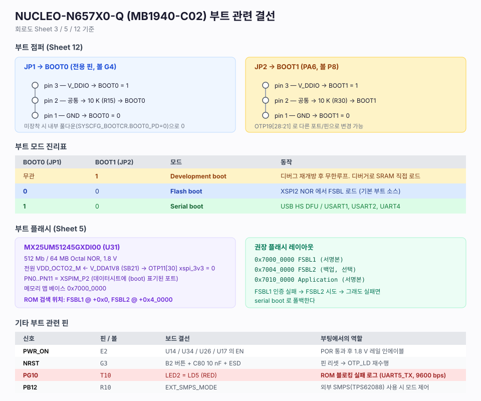

# 03. NUCLEO-N657X0-Q (MB1940-C02) 부트 결선

> 출처: `hardware/mb1940-n657x0q-c02-schematic.pdf` (MB1940C-02, 2024-05-16),
> `~/hdd/git/STM32CubeN6/Drivers/BSP/STM32N6xx_Nucleo/stm32n6xx_nucleo.h`,
> UM3234 Rev5 §3.12.3 (ROM이 사용하는 핀), DS14791 Rev10 (볼 배치)

MCU: **STM32N657X0H3Q** (U21, VFBGA264)

---

## 1. 부트 점퍼

| 점퍼 | 신호 | MCU 볼 | 직렬 저항 | pin1 | pin3 |
|---|---|---|---|---|---|
| **JP1** | `BOOT0` | **G4** (전용 핀) | R15 10 KΩ | GND (=0) | VDDIO (=1) |
| **JP2** | `BOOT1` | **P8** = PA6 | R30 10 KΩ | GND (=0) | VDDIO (=1) |

pin2가 공통(와이퍼)이고 10 KΩ를 거쳐 MCU로 들어간다.
점퍼를 빼면 내부 풀다운(`SYSCFG_BOOTCR.BOOTn_PD = 0`)으로 0이 된다.

| BOOT0 | BOOT1 | 모드 | 용도 |
|---|---|---|---|
| 무관 | 1 | **Development boot** | 디버거로 SRAM에 직접 로드해 개발 |
| 0 | 0 | **Flash boot** | 외장 NOR에서 FSBL 부팅 (양산 형태) |
| 1 | 0 | **Serial boot** | USB DFU / UART 로 이미지 다운로드 |

---

## 2. 부트 플래시

**MX25UM51245GXDI00** (U31) — Macronix 512 Mb / 64 MB Octal NOR, 1.8 V

| 항목 | 값 |
|---|---|
| 인터페이스 | XSPIM_P2 (포트 N) |
| 메모리맵 베이스 | `0x7000_0000` (XSPI2 영역) |
| 전원 | `VDD_OCTO2_M` ← VDDA1V8 (SB21) → **1.8 V** |
| I/O 전원 도메인 | VDDIO3 (PN[12:0]) |
| 관련 OTP | `OTP11[30] xspi_3v3` = **0** 이어야 함 |
| 리셋 | U31 RESET(A4) ← NRST 계열 (D4 BAT60J + R121 DNF) |

### 핀 매핑

| MCU 핀 | 볼 | 신호 | ROM이 부팅에 사용 |
|---|---|---|---|
| PN0 | P17 | `XSPIM_P2_DQS` | HyperFlash 부팅 시만 |
| PN1 | R17 | `XSPIM_P2_NCS1` | ✅ (AF9) |
| PN2 | T17 | `XSPIM_P2_IO0` | ✅ (AF9) |
| PN3 | R15 | `XSPIM_P2_IO1` | ✅ (AF9) |
| PN4 | N17 | `XSPIM_P2_IO2` | HyperFlash 부팅 시만 |
| PN5 | R16 | `XSPIM_P2_IO3` | HyperFlash 부팅 시만 |
| PN6 | P15 | `XSPIM_P2_CLK` | ✅ (AF9) |
| PN7 | T16 | `XSPIM_P2_NCLK` | HyperFlash 부팅 시만 |
| PN8~PN11 | P16/T15/U15/U16 | `XSPIM_P2_IO4..7` | HyperFlash 부팅 시만 |

> **ROM은 sNOR 부팅에서 CLK / NCS1 / IO0 / IO1 네 핀만 쓴다.**
> SPI legacy 1-1-1 모드, indirect 모드, DMA 미사용 (UM3234 Table 27).
> Octal(8-bit DTR)로 올리는 것은 FSBL 이후 소프트웨어의 몫이다.
> XSPIM은 `MUXEN = 0`, `MODE = 1` (swapped) 로 설정되어 XSPI1 컨트롤러가 XSPIM_P2 에 연결된다.

### 권장 플래시 레이아웃

| 오프셋 | 내용 |
|---|---|
| `0x7000_0000` | FSBL1 (서명본) — ROM이 첫 번째로 찾는 위치 |
| `0x7004_0000` | FSBL2 (백업본, 선택) — FSBL1 실패 시 |
| `0x7010_0000` | Application (서명본) |

---

## 3. Serial boot 인터페이스

ROM이 사용하는 핀은 **AFmux 고정이며 OTP로 바꿀 수 없다** (UM3234 §3.12.3).

| 인터페이스 | TX | RX | AF | 이 보드에서 |
|---|---|---|---|---|
| **USART1** | **PE5** | **PE6** | AF7 | **ST-LINK VCP에 연결됨** ⭐ |
| USART2 | PA2 | PF6 | AF7 | 모포/Arduino 커넥터 |
| UART4 | PA0 | PA1 | AF8 | 모포/Arduino 커넥터 |
| USB 2.0 OTG HS | — | — | — | CN8 USB-C (OTG1) |
| UART5 (실패 로그 전용) | **PG10** | — | AF11 | **LED2(LD5, RED)와 공유** ⚠️ |

> ⭐ **USART1(PE5/PE6)이 보드의 ST-LINK V3EC VCP와 같은 핀이다.**
> 즉 BOOT0=1, BOOT1=0 으로 두고 리셋하면, **USB 케이블 하나로 나타나는 VCP 포트에**
> **STM32CubeProgrammer 를 붙여 serial boot 로 이미지를 내려보낼 수 있다.**
> 단, ROM은 USB가 연결되어 있으면 USART를 쓰지 않는다 —
> USB DFU 로 붙는 것이 먼저 잡히므로, USART 경로를 쓰려면 USB를 뽑고 리셋해야 한다.

### SD / eMMC

ROM은 SDMMC1 (`CK=PC12, CMD=PH2, D0=PC8`, AF10) 과
SDMMC2 (`CK=PC2, CMD=PC3, D0=PC4`, AF11) 를 1비트 폭으로 지원하지만,
**MB1940 보드에는 SD 슬롯도 eMMC도 실장되어 있지 않다.**
해당 핀들은 VDDIO4(eMMC용) / VDDIO5(SD용) 도메인에 있다.

---

## 4. 전원

| 신호 | 볼 | 보드 결선 | 부팅에서의 역할 |
|---|---|---|---|
| `PWR_ON` | E2 | U14 / U34 / U26 / U17 의 EN 구동 | POR 통과 후 1.8 V 레일 인에이블 |
| `PDR_ON` | A1 | — | 파워다운 리셋 제어 |
| `VDDA1V8_AON` | F6 | U23 LD39020 (5V에서 상시 ON) | POR가 감시 → 게이팅되면 안 됨 |
| `EXT_SMPS_MODE` | R10 = PB12 | — | 외부 SMPS 모드 제어 |

### VDDCORE — 두 경로가 모두 실장되어 있다

| 경로 | 회로 | RM0486 Figure 17 |
|---|---|---|
| **내부 SMPS** | `VLXSMPS`(J1~J6) → L3 1.0 µH → C143 | option 1 |
| **외부 레귤레이터** | TPS62088 (U17) + L4 240 nH, `PWR_LP`/Q6 로 피드백 전환 | option 2 (bypass) |

외부 경로의 전압:

| `PWR_LP` | VDDCORE |
|---|---|
| 1 | 0.890 V (overdrive) |
| 0 | 0.810 V (nominal) |

CN9 (3×2) / CN12 (7×2) 로 VDDCORE 선택 및 각 레일의 전류 측정
(`I_SENS_INT_VDDCORE_*` / `I_SENS_EXT_VDDCORE_*`)이 가능하다.

---

## 5. 리셋

| 항목 | 값 |
|---|---|
| `NRST` | 볼 G3 |
| 버튼 | B2 (KSC321JLFS) |
| 커패시터 | C80 10 nF (MCU 근접, GND) |
| ESD | U35 ESDALC6V1-1U2 |

RM0486 §14.5.3 의 "NRST 미사용 시 4.7~10 nF 로 GND 연결" 권고와 일치한다.
내부 펄스 스트레처가 최소 20 µs 를 보장하고, `RCC_RDCR.MRD[4:0]` (RPCTL) 로 1~31 ms 까지 늘릴 수 있다.

---

## 6. 클럭

| 소스 | 부품 | 주파수 | 핀 |
|---|---|---|---|
| HSE | X3 | **48 MHz** | OSC_IN / OSC_OUT (PH0 / PH1) |
| LSE | X1 | 32.768 kHz | OSC32_IN / OSC32_OUT (PC14 / PC15) |

ROM은 HSE 주파수를 자동검출한다 (16 / 19.2 / 20 / 24 / 38.4 / 40 / 48 MHz).
고정하려면 `OTP16[13:11] HSE_value = 0b110` (48 MHz), 자동검출 자체를 끄려면 `OTP16[1]`.

---

## 7. LED / 버튼 — 부팅 디버깅 관점

| BSP 이름 | 색 | 부품 | MCU 핀 | 볼 | 비고 |
|---|---|---|---|---|---|
| `LED1` / `LED_BLUE` | BLUE | LD7 | PG8 | T14 | |
| **`LED2` / `LED_RED`** | RED | **LD5** | **PG10** | T10 | ⚠️ **ROM의 UART5_TX 실패 로그 핀** |
| `LED3` / `LED_GREEN` | GREEN | LD6 | PG0 | R13 | |
| `BUTTON_USER` | — | B1 | PC13 | F3 | R171(10 K, DNF) 풀다운 |

> **PG10 주의** — BootROM은 blocking failure가 나면 이 핀으로 **9600 bps** 텍스트 에러 로그를
> 내보낸다. 보드에서는 빨간 LED가 여기 물려 있어서, 부팅이 실패하면 LD5가 불규칙하게
> 깜빡이는 것처럼 보인다. **로그를 실제로 읽으려면 모포 커넥터에서 PG10을 UART 어댑터로 받아야 한다.**
> 반대로, 애플리케이션에서 LED2를 쓰면 그 신호가 ROM 로그와 물리적으로 같은 선이라는 점도 기억해 둘 것.
>
> BOOTFAILN 핀(ROM이 실패 시 low open-drain으로 구동)은 이 보드에 별도 LED로 인출되어 있지 않다.

---

## 8. 디버그

| 항목 | 값 |
|---|---|
| 온보드 디버거 | ST-LINK V3EC |
| SWDIO | PA13 (볼 U6) |
| SWCLK | PA14 (볼 T6) |
| SWO | PB5 (볼 U12) |
| JTDI | PA15 (볼 P12) |
| NJTRST | PB4 (볼 T12) |
| VCP_TX / VCP_RX | PE5 / PE6 = USART1 |
| 외부 디버거 커넥터 | CN5 (별도 시트) |

디버그 접근은 라이프사이클에 종속된다. `CLOSED_UNLOCKED` + Development boot 조합에서
ROM이 디버그를 secure 하게 재개방해 준다. `CLOSED_LOCKED_*` 에서는 인증서 기반
debug authentication 이 필요하다 (RM0486 §3.9, §4.3.11).

---

## 9. 개발 워크플로 요약

| 목적 | JP1 (BOOT0) | JP2 (BOOT1) | 방법 |
|---|---|---|---|
| 코드 작성/디버깅 | 무관 | **1** | STM32CubeIDE 에서 FSBL 프로젝트를 SRAM에 로드 후 디버그 |
| 외장 플래시에 쓰기 | 무관 | **1** | Dev boot 상태에서 CubeProgrammer + ExtMemLoader 로 `0x7000_0000` 에 write |
| 실제 부팅 확인 | **0** | **0** | Flash boot. FSBL은 서명본이어야 함 |
| 이미지 복구 | **1** | **0** | Serial boot. USB DFU 또는 VCP(USART1) |

첫 개발 시 한 번 해 두면 좋은 OTP 설정:

| OTP | 이유 |
|---|---|
| `VDDIO3_HSLV = 1` | 외장 플래시 전송속도 최대화 (CubeN6 README 권고) |
| `OTP11[30] xspi_3v3 = 0` | 보드 플래시가 1.8 V |
| `OTP16[13:11] = 0b110` | HSE 48 MHz 고정 (자동검출 시간 절약) |

> `OTP18[3:0] secure_boot` 은 **되돌릴 수 없다.** 양산 직전까지 태우지 말 것.
