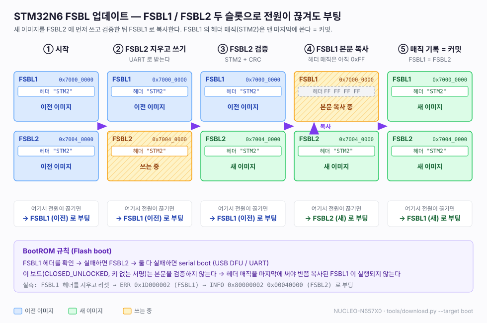
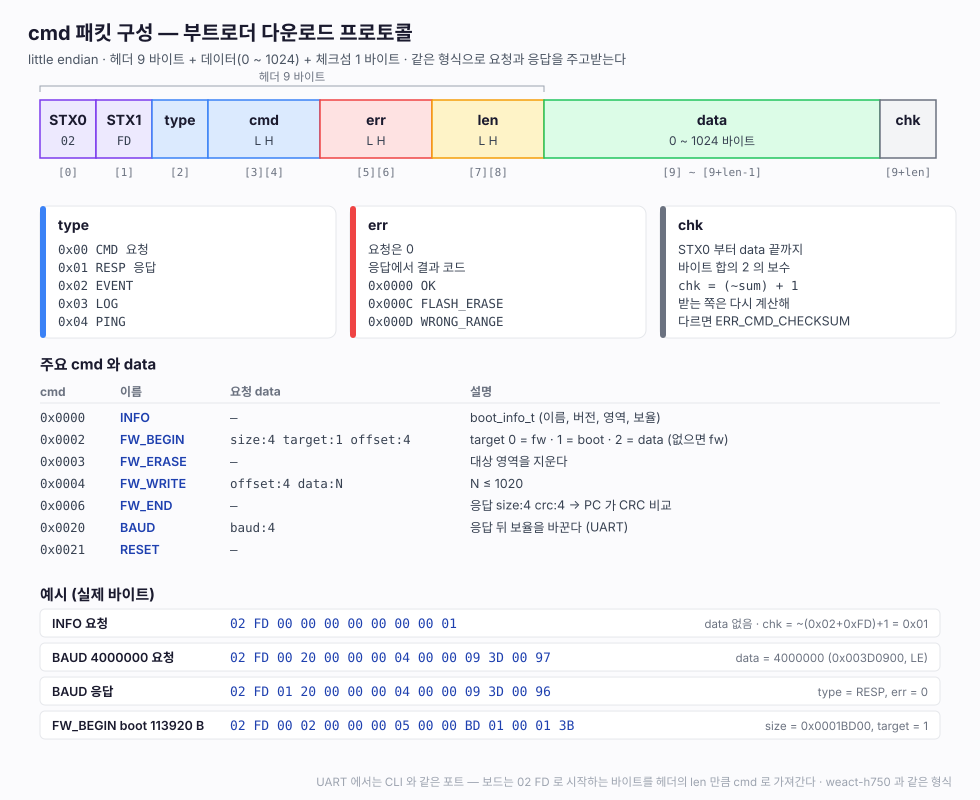
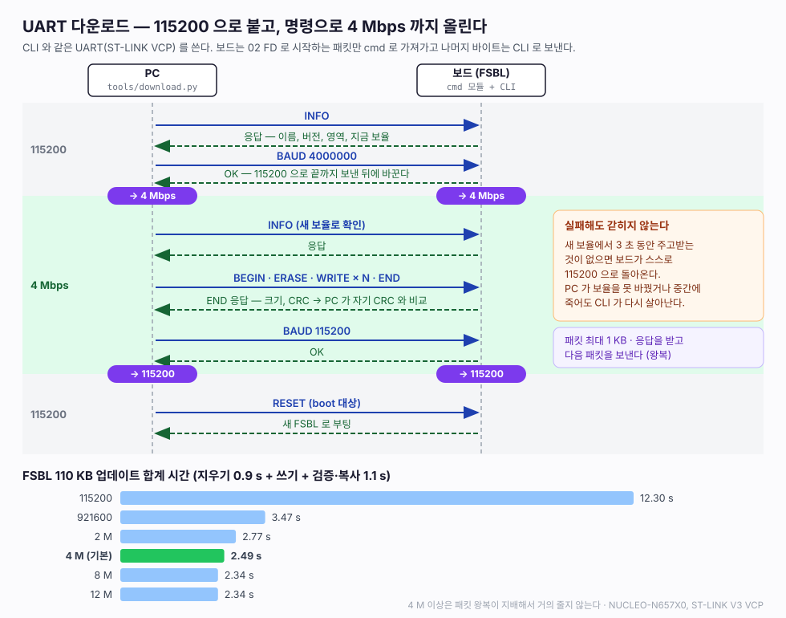
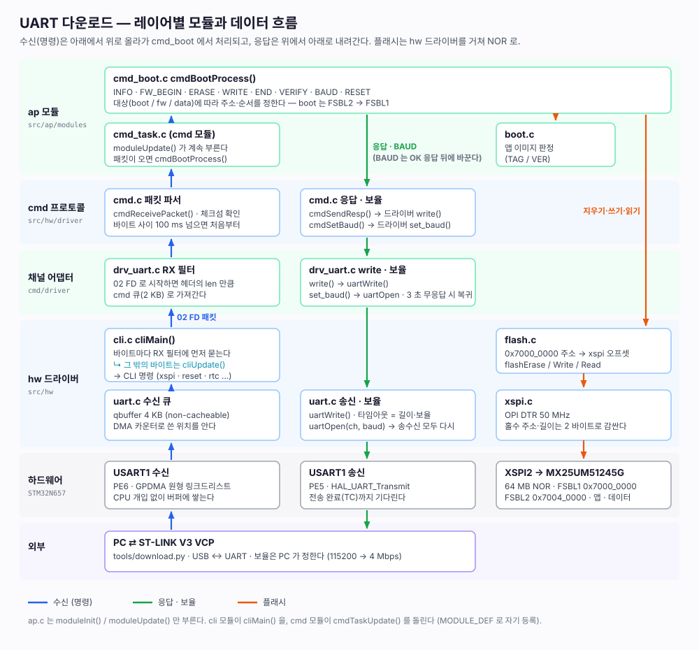

# 28. UART 다운로드 — FSBL / 앱 / 데이터

> 디버거 없이 CLI 와 같은 UART(ST-LINK VCP) 로 외부 NOR 에 쓴다. FSBL 이 부트로더 역할을 한다 (구조 A).
> 프로토콜과 이미지 형식은 weact-h750 부트로더(cmd 패킷, `firm_tag_t` / `firm_ver_t`)를 그대로 쓰고,
> **대상(BOOT / FW / DATA)** 과 **보율 올리기** 를 더했다. 4 Mbps 에서 110 KB FSBL 업데이트가 2.5 초.
> 관련: [26](26-flash-boot.md) (디버거로 쓰기), [25](25-rtc-reset.md) (리셋)

---

## 1. 쓰는 법

```bash
cd firmware/stm32n6-boot
cmake --build build -j20          # build/stm32n6-boot-trusted.bin (서명본)
python3 tools/download.py         # FSBL 업데이트 후 리셋 (VSCode 태스크 download-uart, 포트 자동)
                                  # 포트를 고르려면 태스크 "download-uart (포트 선택)" — Firmware Task Manager 확장

python3 tools/download.py app.bin --target fw                  # 앱
python3 tools/download.py res.bin --target data --offset 0x3000  # 데이터 (4 KB 단위)
```

| 인자 | 기본 | |
|---|---|---|
| `bin` | boot: `build/stm32n6-boot-trusted.bin` | |
| `--target` | `boot` | `boot` / `fw` / `data` |
| `--offset` | 0 | data 영역 안 오프셋. 4 KB 경계여야 한다 (지우기 단위) |
| `--port` | ST-LINK VCP 자동 (`auto` 도 같다) | ST VID(0x0483) 는 다른 장치도 쓴다. ST-LINK PID / 이름으로 고른다 |
| `--baud` | 4000000 | 0 이면 115200 그대로 |
| `--no-reset` | — | boot 대상에서 끝난 뒤 리셋하지 않는다 |
| `--no-baram` | — | baram-term 이 포트를 쥐고 있으면 `baram-ctl release` / `resume` 한다. 이것을 끈다 |

표준 라이브러리 + pyserial. Windows 도 같다.

---

## 2. 플래시 영역 (`hw_def.h`)

| 주소 | 크기 | 영역 | 대상 |
|---|---|---|---|
| `0x7000_0000` | 256 KB | FSBL1 | boot |
| `0x7004_0000` | 256 KB | FSBL2 (BootROM 이 FSBL1 실패 시 쓴다) | boot |
| `0x7008_0000` | 512 KB | 예약 | — |
| `0x7010_0000` | 4 KB | 앱 TAG (`firm_tag_t`) | fw |
| `0x7010_1000` | ~16 MB | 앱 (벡터 1 KB 뒤 `firm_ver_t`) | fw |
| `0x7110_0000` | ~47 MB | 데이터 | data |

FSBL 은 256 KB 를 넘으면 안 된다 (FSBL2 위치 = +0x40000 이 BootROM 고정값). 지금 110 KB.

---

## 3. 대상별 쓰는 순서 — 전원이 끊겨도 부팅할 수 있게



| 대상 | BEGIN | ERASE | WRITE | END |
|---|---|---|---|---|
| **boot** | 아무것도 안 지운다 | FSBL2 슬롯 전체 | FSBL2 | FSBL2 의 `STM2` 헤더 확인 → FSBL1 지우고 복사 → CRC 비교 |
| **fw** | **TAG 섹터부터 지운다** (즉시 무효) | TAG + 크기를 64 KB 로 올림 | 벡터부터 | CRC 계산 → **TAG 기록 = 커밋** |
| **data** | 오프셋 4 KB 정렬 확인 | 4 KB 로 올림 | 오프셋부터 | CRC 만 |

- **boot:** FSBL2 에 쓰는 도중 끊기면 FSBL1 이 옛 이미지 그대로다. FSBL1 을 지우거나 복사하는 도중에 끊기면
  FSBL2 가 이미 새 이미지라 BootROM 이 FSBL2 로 부팅한다. 서명 헤더가 없는 bin 은 END 에서 거부하고 FSBL1 을 건드리지 않는다
- **FSBL1 은 헤더 매직(`STM2`)을 맨 마지막에 쓴다.** 이 보드(CLOSED_UNLOCKED, 키 없는 서명)는 BootROM 이 본문을 검증하지 않는다
  ([02](02-fsbl-loading.md) 5.4절). 헤더부터 쓰면 반쯤 복사된 FSBL1 을 그대로 실행한다. 그래서 본문 → 헤더(매직 뒤) → 매직 순으로 쓴다
- FSBL2 를 지우기 전에 FSBL1 이 깨져 있으면(앞선 업데이트가 복사 중에 끊김) FSBL2 로 FSBL1 을 먼저 되살린다.
  안 그러면 FSBL2 를 지우는 순간 둘 다 없어진다
- 실측: CLI `xspi erase 0 4096` 으로 FSBL1 헤더를 지우고 리셋 → BootROM 트레이스 `ERR 0x1D000002`(FSBL1) →
  `INFO 0x80000002 0x00040000`(FSBL2) 로 부팅. 다음 업데이트 뒤 FSBL1 이 되살아나 `err=0` 으로 부팅
- **fw:** TAG 의 크기는 `firm_ver_t.firm_size` 를 우선한다. 호스트 패딩으로 생기는 stale tag 를 막는다 (weact 에서 겪은 것)
- END 는 `[size:4][crc:4]` 를 돌려준다 (CRC-16 `utilCalcCRC`). 호스트가 자기 계산과 비교한다

FSBL 은 RAM(AXISRAM2) 에서 돌기 때문에 플래시의 자기 이미지(FSBL1)를 직접 고쳐 쓸 수 있다.
weact 앱(XIP)처럼 "자기를 못 써서 부트로더에 넘기는" 제약이 없다. 앱 실행(LRUN / XIP)은 다음 작업이라
`FW_JUMP` / `FW_UPDATE` 는 지금 `ERR_BOOT_JUMP_TO_FW` 를 돌려준다.

---

## 4. 프로토콜

weact-h750 `cmd.c` 를 그대로 가져왔다 (`02 FD type cmd err len data checksum`, 데이터 최대 1024 B).



| 코드 | 명령 | 요청 → 응답 |
|---|---|---|
| 0x0000 | INFO | → `boot_info_t` 104 B (weact 와 같다) + 확장 `cmd_ver, boot2_addr, data_addr, data_size, baud` |
| 0x0001 | VERSION | → 앱 `boot_version_t` (TAG / VER / NONE, 크기, CRC, 이름, 버전) |
| 0x0002 | FW_BEGIN | `[size:4] [target:1] [offset:4]` — **target 이 없으면 fw** (weact `download.py` 와 맞는다) |
| 0x0003 | FW_ERASE | |
| 0x0004 | FW_WRITE | `[offset:4] [data]` |
| 0x0005 | FW_READ | `[offset:4] [len:4] [target:1]` → data (≤ 512 B) |
| 0x0006 | FW_END | → `[size:4] [crc:4]` |
| 0x0007 | FW_VERIFY | → 앱 판정 |
| 0x0020 | BAUD | `[baud:4]` — 응답을 지금 보율로 다 보낸 뒤 바꾼다 |
| 0x0021 | RESET | |

### CLI 와 UART 나눠 쓰기

USB CDC 는 호스트가 연 보율로 주인을 가를 수 있지만 (weact: 115200 = CLI), UART 는 MCU 가 호스트 보율을 모른다.
그래서 nu54v-dk 처럼 **cli 의 RX 필터** 로 가른다 (`cliSetRxFilter()`, `drv_uart.c`).

- `02 FD` 로 시작하면 헤더의 길이만큼 cmd 큐로 가져간다. 나머지 바이트는 cli 로 간다
- 사람이 터미널에서 0x02(Ctrl-B) 뒤에 0xFD 를 칠 일은 없다. 0x02 하나는 버린다
- 나중에 USB CDC 를 붙이면 같은 필터에 weact 의 보율 규칙을 같이 쓴다 (`cmd_task.c` 채널 표에 줄 추가)
- 호스트가 포트를 열려면 baram-term 이 놓아야 한다. `download.py` 가 `baram-ctl release` / `resume` 을 한다

### 보율 올리기



1. 115200 으로 INFO
2. `BAUD n` → 보드는 응답을 보내고 바꾼다 → 호스트도 바꾸고 INFO 로 확인
3. 끝나면 `BAUD 115200`

**새 보율로 3 초 동안 주고받는 것이 없으면 보드가 스스로 115200 으로 돌아온다.** 호스트가 바꾸지 못했거나
중간에 죽어도 보드가 엉뚱한 보율에 갇히지 않는다 (확인함: BAUD 4 Mbps 뒤 호스트를 그대로 두면 3 초 뒤 CLI 가 115200 으로 응답).
송신은 `HAL_UART_Transmit` 이 전송 완료까지 기다리므로 응답이 잘린 채 보율이 바뀌지 않는다.

---

### 코드 구조 (다른 프로젝트와 같은 모양)



| 파일 | |
|---|---|
| `src/ap/modules/module.c/h` | 모듈 자기 등록 (`MODULE_DEF` → 링커 `.module` 섹션). titan-mini 판 (const 디스크립터, `update(arg)`, 우선순위 7 단계, `module info`) |
| `src/ap/modules/common/cli/cli.c` | cli 모듈 (`cliOpen` / `cliMain`) |
| `src/ap/modules/cmd/cmd_task.c/h` | cmd 모듈. `static cmd_t` / `cmd_driver_t` 배열을 갖고 드라이버를 채운다. 헤더에는 `cmdTaskInit/Update` 만 |
| `src/ap/modules/cmd/driver/drv_uart.c/h` | `drvUartInit(cmd_driver_t *p_driver, ch, baud)` 가 함수 포인터를 채우고 ch/baud 를 `p_driver->args` 에 둔다 (stm32h7-lvgl 과 같다). 전역 extern 없음. 3 초 무응답 복귀(`drvUartUpdate`)도 여기 |
| `src/ap/modules/cmd/process/cmd_boot.c/h` | 명령 처리 |
| `src/ap/modules/boot/boot.c/h` | 앱 이미지 판정 (TAG / VER) |
| `src/hw/driver/cmd.c`, `flash.c` | 패킷 파서 (weact 그대로) + `cmdSetBaud/GetBaud`, 주소 기반 플래시 접근 |

**보율도 드라이버 함수 포인터로 넘긴다.** `cmd_driver_t` 에 선택 항목 `set_baud` / `get_baud` 를 더했다 (보율이 없는 채널은 NULL).
명령 처리(`cmd_boot.c`)는 `cmdSetBaud(p_cmd, baud)` 만 부르고 채널 종류를 모른다 — 처음에는 `drvUartSetBaud()` 를 직접 불러
ap 의 명령 처리가 채널 어댑터를 아는 구조였다. 그래서 BAUD 도 응답과 같은 길(cmd_boot → cmd.c → drv_uart → uart.c)로 내려간다.

`ap.c` 는 `moduleInit()` / `moduleUpdate()` 만 부른다. cmd 모듈은 cli 보다 늦게(LOWEST) 열어 cli 에 RX 필터를 건다.

## 5. 측정 (110 KB FSBL, boot 대상)

| 보율 | 쓰기 | 합계 (지우기 0.9 s + 확인·복사 1.1 s 포함) |
|---|---|---|
| 115200 | 10.21 s (10.8 KB/s) | 12.30 s |
| 921600 | 1.42 s (77.6 KB/s) | 3.47 s |
| 2 M | 0.73 s (151 KB/s) | 2.77 s |
| **4 M (기본)** | 0.45 s (247 KB/s) | 2.49 s |
| 8 M | 0.31 s (361 KB/s) | 2.34 s |
| 12 M | 0.29 s (382 KB/s) | 2.34 s |

4 M 이상은 패킷마다 응답을 기다리는 왕복이 지배해서 얻는 것이 적다. 그래서 기본값을 4 M 으로 두었다.
fw 200 KB (랜덤) : 지우기 0.95 s, 쓰기 0.79 s, 확인 0.09 s → 판정 TAG. data 10 KB @+0x3000 : 0.11 s.
오프셋 0x3001 은 `WRONG_RANGE` 로 거부.

---

## 6. 막혔던 지점

| 증상 | 원인 | 해결 |
|---|---|---|
| 자동 포트가 엉뚱한 장치 | ST VID 를 쓰는 다른 장치(WISH61-HE 키보드)가 먼저 잡혔다 | ST-LINK PID / 이름으로 고른다 |
| (설계) 최대 패킷이 수신 버퍼보다 큼 | UART RX 버퍼 1 KB < 패킷 1034 B | 4 KB 로 늘렸다 |
| (설계) 115200 에서 1 KB 송신이 100 ms 타임아웃에 걸릴 수 있다 | `HAL_UART_Transmit` 타임아웃 고정 | 길이와 보율로 계산 |
| 홀수 크기 이미지의 쓰기·확인 실패, CLI `xspi read` 가 홀수 주소에서 `Fail` | OPI DTR 은 2 바이트 단위라 HAL 이 홀수 주소·길이를 거부한다. 실패한 명령이 XSPI 를 오류 상태로 남겨 그 뒤 지우기까지 실패했다 | `xspiRead/Write` 가 앞뒤 홀수 바이트를 2 바이트로 감싼다 (읽기는 필요한 쪽만, 쓰기는 빈 쪽을 0xFF 로). 10001 B DATA, 200001 B FW 확인 |
| (설계) 반쯤 복사된 FSBL1 이 실행될 수 있다 | 키 없는 서명이라 BootROM 이 본문을 검증하지 않는다 | FSBL1 매직을 마지막에 쓴다 (3절) |
